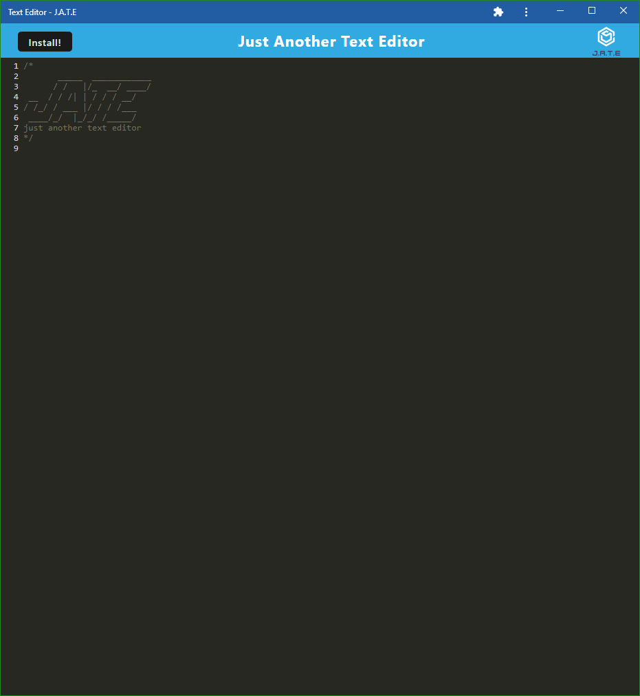

# textEditor

## Description

This progressive web application is a simple text editor that stores text in IndexedDB and 
will reload the text if you leave the page. The text editor uses a webpack configuration to build itself and 
works offline after a user installs the app from the deployed Heroku page. 

## Learned

- Build scripts in package.json
- Build webpack
- Use loaders to build webpack
- Use IndexedDB
- Utilize service-workers
- Configure an installation of a service worker

## Table of Contents

- [Description](#description)
- [Learned](#learned)
- [Installation](#installation)
- [Usage](#usage)
- [Credits](#credits)
- [Features](#features)

## Installation

NPM | Notes
--- | ---
concurrently | Concurrent running of client and server
nodemon | Allows server to stay running
express | Connection to server
@babel/core | Babel connection
@babel/plugin-transform-runtime | Babel connection
@babel/preset-env | Babel connection
@babel/runtime | Babel connection
babel-loader | Babel loader for webpack
css-loader | CSS loader for webpack
style-loader | Style loader for webpack
html-webpack-plugin | HTML plugin for webpack
http-server | Using HTTP
webpack | Build webpack
webpack-cli | Build webpack
webpack-dev-server | Build webpack
webpack-pwa-manifest | Build webpack
workbox-webpack-plugin | Workbox plugin for webpack
code-mirror-themes | JavaScript code mirror theme
idb | IndexedDB handler

Database | Database name
--- | ---
IndexedDB | jate
IndexedDB | workbox-expiration

**To install the _code_ one must obtain it all and run `npm run start` within the terminal. This will build the webpack!**

## Usage

Upon loading on the deployed Heroku page, click on the text editing section and type to see the code editor in action. Once the 
editor has lost focused on itself, jate database within IndexedDB will store the typed out text into itself. Upon page reload 
the text can be found rendered and still there. 

When clicking the install button, a window will prompt and ask if the user would like to download the progressive web application. 
Select yes and an icon will appear on the desktop and allow the user to access the text editor at anytime, even while offline! 
The text editor will function the same offline as it will online! 

## Credits

Deployed to Heroku at: https://text-editor-aditore.herokuapp.com/ 

Starter code by: UW Coding Bootcamp 
Code completed by: Anthony Ditore 
Github: [aditore](https://github.com/aditore) 

## Features

- IndexedDB
- Service Workers